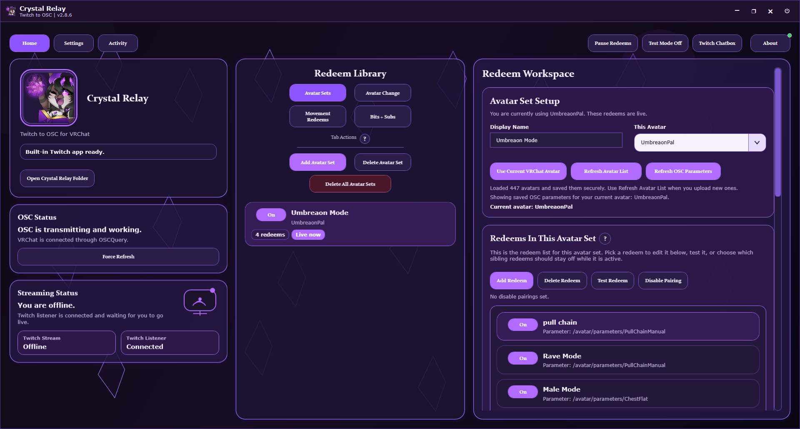

# Crystal Relay

**Windows desktop Twitch-to-VRChat control through OSC and OSCQuery.**



Crystal Relay is a Windows desktop app that connects Twitch events to VRChat through OSC and OSCQuery. It is built to keep setup cleaner, wording friendlier, and stream control easier to manage while you are live.

---

## What Crystal Relay Handles

- **Twitch triggers:** Channel Points, Bits, and Subscriptions
- **OSC actions:** Avatar Parameters, Avatar Changes, and Player Movement
- **Rule areas:** Avatar Sets, Avatar Change, Movement Redeems, and Bits + Subs Overrides
- **Managed rewards:** Twitch custom reward syncing, cleanup recovery, cooldown-aware state, and per-redeem color support
- **Chat tools:** Built-in Twitch Chatbox with optional VRChat chat relay
- **VRChat tools:** Avatar login with 2FA, avatar cache, and OSC parameter cache
- **Polish:** Multiple built-in themes, localization, About-page live cards, and crash logging

## Trigger Types and Actions

| Area | What it does |
| --- | --- |
| **Avatar Sets** | Groups redeems by avatar so they only stay live while that avatar is active |
| **Avatar Change** | Switches to another avatar, then optionally returns after a timer |
| **Movement Redeems** | Sends timed VRChat movement inputs that are not tied to one avatar |
| **Bits + Subs Overrides** | Runs global paid override rules that can preempt normal redeems |

| Action Type | Result |
| --- | --- |
| **Avatar Parameter** | Sends bool, int, or float parameter values into VRChat |
| **Avatar Change** | Swaps to another avatar temporarily or permanently |
| **Player Movement** | Holds a movement input for the configured active time |

## Main Features

- Managed Twitch reward syncing with cleanup and recovery handling
- Pause Redeems for instantly disabling Twitch-triggered actions during stream moments
- Streaming Test Mode for checking managed reward behavior before you go live
- Per-redeem ready and cooldown colors for managed channel point rewards
- Priority-based Bits + Subs override queueing with timed stacking controls
- Optional bot info messages for supporter overrides
- Theme support across the main window, dialogs, and chatbox
- Built-in language support for English, Spanish, Japanese, German, French, Portuguese (Brazil), Swedish, Italian, Simplified Chinese, Traditional Chinese, Korean, Russian, Polish, and Thai

## Quick Start

1. Launch Crystal Relay.
2. Open **Settings**.
3. Connect your **Broadcaster** Twitch account.
4. Optional: connect a **Bot** account for bot chat messages.
5. Optional but recommended: connect **VRChat Avatar Access** so avatar lists and OSC parameter tools are available.
6. Return to **Home** and build the redeem rules you want.
7. Use **Test Redeem** or **Streaming Test Mode** before going live if you want to validate behavior safely.

## Managed Twitch Rewards

Crystal Relay can create and manage Twitch custom rewards for supported broadcaster accounts.

- Managed rewards turn on while you are live, or while **Streaming Test Mode** is enabled
- On shutdown, Crystal Relay tries to disable managed rewards cleanly
- If the previous session ended badly, Crystal Relay runs a recovery cleanup pass on the next launch
- Reward availability follows cooldowns, avatar matching, disable-pairing, and Bits/Subs override suppression rules
- Twitch custom reward management requires a broadcaster account that supports custom rewards

## Twitch Chatbox

- Open it from the **Twitch Chatbox** button
- Supports font choice, text size, overlay mode, always-on-top, and 12-hour or 24-hour timestamps
- Can optionally relay Twitch chat into VRChat with adjustable pacing
- Uses the same theme family as the main app

## VRChat Integration

- Supports VRChat username/password login with 2FA
- Uses local avatar and OSC parameter caches to keep setup faster between launches
- **Refresh Avatar List** after uploading new avatars
- **Refresh OSC Parameters** when you want the latest parameters for the avatar you are wearing
- Uses OSCQuery and OSC status monitoring to help confirm live connectivity

## Themes

Current built-in themes:

- Void Crystal
- Dream Scape
- Bubblegum
- Cosmic Puppy Girl
- Peaches & Cream
- Moon Bunny Wink
- Dread Night Bar
- Baked
- MainFrame
- Trash Kitty

## Local Data and Crash Logs

Crystal Relay stores local data in:

`C:\Users\<YourUser>\AppData\Local\CrystalRelay`

This folder includes:

- secure app data
- runtime config
- avatar and OSC caches
- crash logs
- save-transfer files

Crash logs are written under:

`C:\Users\<YourUser>\AppData\Local\CrystalRelay\CrashLogs`

Use **Open Crystal Relay Folder** inside the app if you want to jump there quickly.

## Build and Run From Source

Build the solution:

```powershell
dotnet build .\VrcTwitchOscBridge.slnx
```

Run from source:

```powershell
powershell -ExecutionPolicy Bypass -File .\Run-Crystal-Relay-Source.ps1
```

Create a test package:

```powershell
powershell -ExecutionPolicy Bypass -File .\Build-Crystal-Relay-Test.ps1
```

Create a release package:

```powershell
powershell -ExecutionPolicy Bypass -File .\Build-Crystal-Relay-Release.ps1
```

Packaged Windows builds are published on the public GitHub Releases page:

[Crystal Relay Releases](https://github.com/seluvia/crystal-relay-public/releases)

## Versioning

Crystal Relay uses `major.minor.patch` with decimal rollovers per segment.

Examples:

- `1.0.9 -> 1.1.0`
- `1.9.9 -> 2.0.0`
