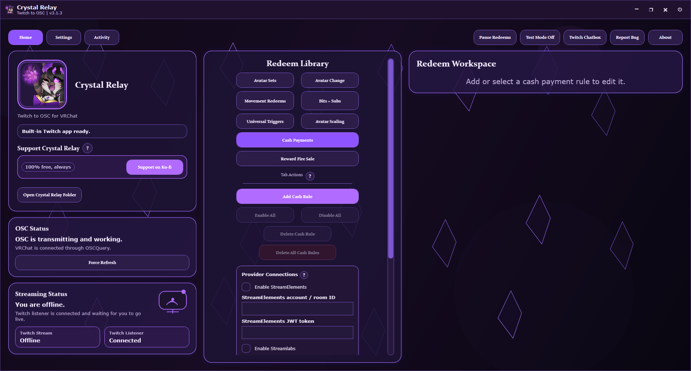

# Crystal Relay

[](https://discord.gg/6DvWJXN6A2)

**Windows desktop Twitch-to-VRChat control through OSC and OSCQuery.**

**Want the Windows download right away?** Open the [Crystal Relay Releases page](https://github.com/seluvia/crystal-relay-public/releases), or use **Releases** on the right side of the GitHub page.

[](#build-and-run-from-source)
[](#build-and-run-from-source)
[](LICENSE)
[](#network-and-privacy-basics)
[](#vrchat-and-osc)



Crystal Relay connects Twitch events to VRChat through local OSC and OSCQuery control. It is built for streamers who want Channel Point rewards, chat commands, bits, subs, follows, avatar parameters, avatar changes, movement redeems, and chatbox relay tools without turning setup into a maze.

- [Download packaged releases](https://github.com/seluvia/crystal-relay-public/releases)
- [Watch the tutorial video](https://github.com/seluvia/crystal-relay-public/releases/download/v2.9.0/CrystalRelay-Tutorial-v2.9.0.mp4)
- [Build and run from source](#build-and-run-from-source)
- [Help translate Crystal Relay](TRANSLATING.md)
- [Support free development on Ko-fi](https://ko-fi.com/screminpal)

## Contents

| Start Here | Stream Tools | Technical Info | Project Info |
| --- | --- | --- | --- |
| [Quick Start](#quick-start) | [Managed Twitch Rewards](#managed-twitch-rewards) | [Network and Privacy Basics](#network-and-privacy-basics) | [Open Source and AI Transparency](#open-source-and-ai-transparency) |
| [What Crystal Relay Handles](#what-crystal-relay-handles) | [Avatar Scaling](#avatar-scaling) | [Local Data and Crash Logs](#local-data-and-crash-logs) | [License](#license) |
| [Trigger Areas and Actions](#trigger-areas-and-actions) | [Reward Fire Sale](#reward-fire-sale) | [Build and Run From Source](#build-and-run-from-source) | [Versioning](#versioning) |
| [Main Features](#main-features) | [Universal Triggers](#universal-triggers) | [Releases](#releases) | |
| [Release Highlights](#current-release-highlights) | [Cash Payments](#cash-payments) | [VRChat and OSC](#vrchat-and-osc) | |
| | [Twitch Chatbox](#twitch-chatbox) | | |

## Quick Start

1. Launch **Crystal Relay**.
2. Open **Settings**.
3. Connect your **Broadcaster** Twitch account.
4. Optional: connect a **Bot** Twitch account for bot chat messages.
5. Optional but recommended: connect **VRChat Avatar Access** so avatar lists and OSC parameter tools are available.
6. Return to **Home** and create the redeem rules you want.
7. Use **Test Redeem** or **Streaming Test Mode** before going live so you can confirm behavior safely.

## What Crystal Relay Handles

| Category | Supported Areas |
| --- | --- |
| **Twitch triggers** | Channel Points, Chat Commands, Bits, Subscriptions, Gift Subs, Follows |
| **Cash payment triggers** | StreamElements tips, Streamlabs donations, and Ko-fi tips |
| **OSC actions** | Avatar Parameters, Set Trigger outfit groups, Avatar Changes, Player Movement, Avatar Scaling |
| **Rule areas** | Avatar Sets, Avatar Change, Movement Redeems, Bits + Subs Overrides, Universal Triggers, Cash Payments, Avatar Scaling, Reward Fire Sale |
| **Managed rewards** | Twitch reward creation, adoption, syncing, cap-safe recycling, cooldown-aware state, per-redeem colors |
| **Chat tools** | Built-in Twitch Chatbox, optional VRChat chat relay, optional bot/broadcaster trigger announcements |
| **VRChat tools** | VRChat login with 2FA, avatar cache, OSC parameter cache, OSCQuery discovery |
| **App polish** | Built-in themes, community-ready localization, About-page live cards, update alerts, in-app bug reports, crash logging |

## Main Features

- Managed Twitch reward syncing with cleanup and recovery handling
- Linked existing Twitch rewards stay listen-only, so Crystal Relay can trigger from them without changing their Twitch setup
- Pause Redeems for quickly disabling Twitch-triggered actions during stream moments
- Streaming Test Mode for checking managed reward behavior before going live
- Per-redeem ready and cooldown colors for managed Channel Point rewards
- Avatar Set **Set Trigger** outfit actions that snapshot safe VRChat LocalAvatarData values, send grouped outfit parameters, and restore changed values after Active Time
- Avatar Scaling with channel-point rewards, chat commands, bits, subs, gift subs, follows, master reward gating, and paid Supporter Growth
- Cash Payments for StreamElements, Streamlabs, and Ko-fi tips that can trigger OSC parameters, Set Trigger outfits, avatar changes, avatar roulette, and Avatar Scaling without creating Twitch rewards
- Reward Fire Sale goals that can discount Crystal Relay-owned `VRC:` rewards for temporary or permanent sale moments
- Avatar-scoped Bits + Subs supporter triggers, including Bits outfit names with fuzzy matching for casing, spacing, and spelling mistakes
- Optional bot info messages for supporter overrides
- Avatar-aware redeem libraries for avatar-specific and global behaviors
- In-app bug reporting with opt-in sanitized logs
- Built-in Twitch Chatbox with theme-aware settings and optional VRChat relay
- Theme support across the main window, dialogs, and chatbox
- Built-in language support for English, Spanish, Japanese, German, French, Portuguese (Brazil), Swedish, Italian, Simplified Chinese, Traditional Chinese, Korean, Russian, Polish, and Thai

## Current Release Highlights

Recent releases include larger systems shaped by streamer feedback:

- **Cash Payments and Ko-fi hosted relay**: StreamElements, Streamlabs, and Ko-fi tips can trigger Crystal Relay actions, and Ko-fi can use a Crystal Relay relay so streamers do not need Cloudflare Tunnel, ngrok, router forwarding, or a public local webhook.
- **Reward Fire Sale**: builds a Bits or channel-point funding goal, then discounts Crystal Relay-owned `VRC:` rewards by the reached tier.
- **Fire Sale funding reward**: optional dedicated `VRC: Fire Sale Fund` reward with editable point-to-progress conversion, cooldown, and ready/cooldown colors.
- **Reward descriptions**: Crystal Relay-created channel-point rewards can now use editable Twitch descriptions while linked rewards stay listen-only.
- **Float redeem controls**: float Avatar Parameter redeems can use decimal or percent input, optional smooth transitions, and active boost rewards while a timed float redeem is running.
- **Supporter Growth scale bank**: bits, subs, resubs, and gift subs feed one paid Avatar Scaling timer instead of replacing each other.
- **Supporter Growth cheer keywords**: `Cheer100 grow` and `Cheer100 shrink` can choose positive or negative Bits scaling while still adding paid time.
- **Reward scale overlay during paid growth**: optional channel-point or chat scale changes can temporarily overlay paid growth without shortening the paid timer.
- **Set Trigger outfit restore**: outfit triggers learn changed safe LocalAvatarData parameters after a 70-second diff window and restore from the copied pre-trigger snapshot.
- **In-app bug reports**: About page reports can create GitHub issues through a secure Cloudflare Worker without requiring a GitHub account.
- **Beta update notifications**: the app can notify stable and beta users when a newer beta is available.
- **Twitch API safety work**: reward sync is fingerprinted, redundant syncs are skipped, linked rewards remain listen-only, and rate-limit backoff is respected.

## Trigger Areas and Actions

### Rule Areas

| Area | What It Does |
| --- | --- |
| **Avatar Sets** | Groups redeems by avatar so they only stay live while that avatar is active. |
| **Avatar Change** | Switches to another avatar, then optionally returns after a timer. |
| **Movement Redeems** | Sends timed VRChat movement inputs that are not tied to one avatar. |
| **Bits + Subs Overrides** | Runs paid avatar-scoped supporter triggers and global avatar-change overrides. |
| **Universal Triggers** | Imports or creates general Twitch interactions for commands, rewards, bits, subs, gift subs, and follows. |
| **Cash Payments** | Runs StreamElements, Streamlabs, and Ko-fi tip rules without creating or managing Twitch rewards. |
| **Avatar Scaling** | Controls VRChat Avatar Scaling through `/avatar/eyeheight`, including Supporter Growth and timed restore behavior. |
| **Reward Fire Sale** | Builds a stream goal that can temporarily or permanently discount Crystal Relay-owned `VRC:` rewards. |

### Action Types

| Action Type | Result |
| --- | --- |
| **Avatar Parameter** | Sends bool, int, or float parameter values into VRChat. |
| **Set Trigger** | Sends multiple bool, int, or float outfit parameters together, then restores changed values after Active Time. |
| **Avatar Change** | Swaps to another avatar temporarily or permanently. |
| **Player Movement** | Holds a movement input for the configured active time. |
| **Avatar Scaling** | Sends height changes through VRChat's Avatar Scaling OSC endpoint. |

## Managed Twitch Rewards

Crystal Relay can create and manage Twitch custom rewards for supported broadcaster accounts.

- Managed rewards turn on while you are live or while **Streaming Test Mode** is enabled.
- On shutdown, Crystal Relay tries to disable managed rewards cleanly.
- If the previous session ended badly, Crystal Relay runs a recovery cleanup pass on the next launch.
- Reward availability follows cooldowns, avatar matching, disable-pairing, and Bits/Subs override suppression rules.
- Crystal Relay-owned rewards use the `VRC:` prefix and can be updated, colored, disabled, recycled, or deleted when you opt into cleanup.
- Linked existing rewards are listen-only. Crystal Relay listens for the redemption, but it does not rename, recolor, recost, hide, delete, or cooldown-edit them.
- If Twitch reward slots are full, Crystal Relay can recycle inactive app-owned `VRC:` rewards that are not needed for the current avatar before creating more.
- Reward API calls are gated by desired-state fingerprints so normal timers, tests, and unchanged runtime events do not repeatedly spam Twitch.
- Twitch custom reward management requires a broadcaster account that supports custom rewards.

## Avatar Scaling

Avatar Scaling controls VRChat's `/avatar/eyeheight` endpoint for scale rewards and paid growth moments.

- Supports Channel Point rewards, chat commands, Bits, subscriptions, gift subscriptions, follows, and Supporter Growth.
- Scale modes include set height, random height, relative height, multiplier, and presets.
- Timed scale redeems restore to an explicit **Return Height**.
- Supporter Growth combines Bits, subs, resubs, and gift subs into one paid timer bank with soft cap and max cap controls.
- Bits Supporter Growth can use editable grow/shrink keywords, for example `Cheer100 grow` or `Cheer100 shrink`.
- Reward or chat scale changes can optionally overlay paid Supporter Growth without changing the paid timer.
- Manual avatar swaps during active scaling carry the active height onto the new avatar and restore when the timer ends.

## Reward Fire Sale

Reward Fire Sale is a global stream goal for discount moments.

- Bits can add progress directly.
- An optional `VRC: Fire Sale Fund` channel-point reward can add progress using an editable point-to-progress conversion.
- The sale can use one tier or the highest reached tier from a multi-tier goal list.
- Temporary sales restore prices when the timer ends; permanent sales stay active until stopped.
- Stream end resets the sale, clears progress, and queues normal reward prices to restore.
- Discounts apply only to Crystal Relay-owned `Create/manage reward` `VRC:` rewards. Linked existing rewards stay unchanged.

## Universal Triggers

Universal Triggers are for broader Twitch interaction setups that should live outside avatar-specific redeem lists.

- Import **Fooma Twitch Interaction** JSON configs for assist-style OSC actions.
- Supports **Chat Commands**, **Channel Point Rewards**, **Bits**, **Subscriptions**, **Gift Subscriptions**, and **Follows**.
- Fuses matching `!command` entries into their matching Channel Point reward so one card can handle both trigger paths.
- Sends direct OSC action lists, with optional random action selection and queued activations.
- Keeps Universal Channel Point rewards outside Avatar Sets, so they are not tied to a configured avatar profile.
- For Universal rewards that send `/avatar/parameters/...` actions, Crystal Relay checks the local OSC JSON for the avatar VRChat is currently running. If at least one needed parameter path is found, the reward can be made available on Twitch; if the path is missing or the JSON is not ready, the reward stays hidden/off instead of being offered.
- Universal actions that do not target avatar-parameter paths do not need this parameter gate.

Need the Fooma Twitch Interaction system? Get it here:

[Fooma Twitch Interaction on Gumroad](https://foomaring.gumroad.com/l/lmrjbl)

## Cash Payments

Cash Payments let StreamElements tips, Streamlabs donations, and Ko-fi tips run Crystal Relay actions without making a Twitch Channel Point reward.

- Supported actions include avatar parameters, Set Trigger outfit groups, Avatar Change, Avatar Roulette, and Avatar Scaling.
- Amount filters use the provider amount and currency exactly as the provider sends them. Crystal Relay does not convert currencies in this system.
- Cash-triggered avatar changes count as paid support actions, so they can bypass Avatar Scaling's optional avatar-change blocker like Bits and Subs overrides.
- Provider failures stay isolated. A Ko-fi relay issue should not stop Twitch, OSC, VRChat, StreamElements, or Streamlabs behavior.

### Ko-fi Hosted Relay Privacy

Ko-fi sends payment automation through webhooks, which means it needs a public HTTPS URL. Crystal Relay's hosted Ko-fi relay exists only to carry that Ko-fi webhook to your running desktop app, so streamers do not need to set up Cloudflare Tunnel, ngrok, router port forwarding, or a public local server.

The relay does **not** save Ko-fi webhook payloads, payment history, emails, messages, verification tokens, client secrets, or payment databases. It keeps only live in-memory connection state long enough to forward a minimal tip event to your running Crystal Relay app and receive an acknowledgement. If Crystal Relay is offline, the relay returns a retry response to Ko-fi instead of storing the payment for later.

Crystal Relay stores your Ko-fi verification token and relay client secret locally through **Windows Credential Manager**. The hosted relay uses those secrets only to verify that the webhook belongs to your Crystal Relay setup and to deliver the trigger to the connected desktop app.

Advanced users can still use the local Ko-fi webhook mode, but the hosted relay is the recommended setup for most streamers because it avoids network setup outside the app.

## Twitch Chatbox

Open the **Twitch Chatbox** from inside Crystal Relay to add a compact, theme-aware chat display for stream use.

- Supports font choice, text size, overlay mode, always-on-top, and 12-hour or 24-hour timestamps.
- Can optionally relay Twitch chat into VRChat with adjustable pacing.
- Supports text-only and emote-rendered chat display paths.
- Uses the same theme family as the main app.

## VRChat and OSC

Crystal Relay supports VRChat username/password login with 2FA and uses local avatar and OSC parameter caches to keep setup faster between launches.

- Use **Refresh Avatar List** after uploading new avatars.
- Use **Refresh OSC Parameters** when you want the latest parameters for the avatar you are wearing.
- OSCQuery discovery helps Crystal Relay find the running VRChat client.
- OSC sends avatar parameters, avatar changes, movement inputs, and chatbox messages to VRChat locally.
- Set Trigger outfit restores may read VRChat LocalAvatarData as a read-only safety snapshot source. Height, scale, eye-height, locomotion, gesture, grab, pose, and transient parameters are excluded from Set Trigger restore logic.

## Themes and Localization

Current built-in themes:

- Void Crystal
- Treetender's Arm
- Carrot Patch
- Dream Scape
- Bubblegum
- Cosmic Puppy Girl
- Peaches & Cream
- Moon Bunny Wink
- Dread Night Bar
- Baked
- MainFrame
- Trash Kitty
- Stinky Online

Built-in language support includes English, Spanish, Japanese, German, French, Portuguese (Brazil), Swedish, Italian, Simplified Chinese, Traditional Chinese, Korean, Russian, Polish, and Thai.

Crystal Relay accepts public translation help through GitHub issues and pull requests. The English source file is `VrcTwitchOscBridge/Resources/Localization/en-US.extra.json`, and the translated files live beside it as `*.extra.json`.

Want to help improve wording in your language? See [TRANSLATING.md](TRANSLATING.md). You can either open a translation issue with suggested wording or submit a pull request that edits the JSON translation files directly.

## Network and Privacy Basics

Crystal Relay uses standard network connections only for the services needed to run.

| Service | Connection Use |
| --- | --- |
| **Twitch** | Outbound HTTPS for login, Helix API calls, reward management, emote data, and optional bot chat sends. Live Twitch events are received through EventSub over WebSocket. |
| **VRChat** | Outbound HTTPS for login, 2FA, logout, and avatar list refreshes. Runtime avatar control uses local OSC and OSCQuery traffic between Crystal Relay and VRChat. |
| **GitHub** | Outbound HTTPS to the public Crystal Relay releases API for update checks. |
| **Cloudflare** | Outbound HTTPS to Crystal Relay Cloudflare Workers for About-page beta live-status cards and optional in-app bug reports. Bug reports are user-submitted, logs are opt-in and sanitized before sending, and Twitch tokens, VRChat auth cookies, passwords, and private app data must never be sent. |
| **Ko-fi relay** | Optional outbound WebSocket from Crystal Relay to the hosted Ko-fi relay, plus Ko-fi HTTPS webhook delivery to the relay. The relay forwards only minimal tip trigger fields to the connected app and does not save webhook payloads, payment history, emails, messages, tokens, or secrets. |
| **Local machine** | OSC and OSCQuery use local UDP/TCP ports for discovery, avatar parameters, movement inputs, avatar changes, and chatbox messages. Crystal Relay advertises loopback OSCQuery endpoints and uses local dynamic UDP/TCP ports for app-to-VRChat communication. This is not a public remote-control server. |

Crystal Relay does **not** publish Twitch tokens, VRChat auth cookies, private IP addresses, local usernames, downloaded VRChat avatar files, or runtime app data into the README or public repository.

Login/session secrets are stored locally through **Windows Credential Manager**, and runtime caches stay in the user's local app data folder.

Keep VRChat OSC and OSCQuery local/private. Do not expose Crystal Relay or VRChat OSC/OSCQuery ports through router port-forwarding or broad firewall rules.

## Local Data and Crash Logs

Crystal Relay stores local data in:

```text
%LOCALAPPDATA%\CrystalRelay
```

This folder includes:

- secure app data
- runtime config
- avatar and OSC caches
- crash logs
- save-transfer files

Crash logs are written under:

```text
%LOCALAPPDATA%\CrystalRelay\CrashLogs
```

Use **Open Crystal Relay Folder** inside the app to jump there quickly.

Crash logs are sanitized before they are written. Crystal Relay redacts common token, cookie, authorization header, Twitch login code, VRChat auth, and local Windows username path patterns.

## Build and Run From Source

Prerequisites:

- Windows
- .NET 10 SDK with Windows desktop support

Build the solution:

```powershell
dotnet build .\VrcTwitchOscBridge.slnx
```

Check NuGet dependencies for known vulnerabilities:

```powershell
powershell -ExecutionPolicy Bypass -File .\Check-Crystal-Relay-Dependencies.ps1
```

Run from source:

```powershell
powershell -ExecutionPolicy Bypass -File .\Run-Crystal-Relay-Source.ps1
```

Create a test package:

```powershell
powershell -ExecutionPolicy Bypass -File .\Build-Crystal-Relay-Test.ps1
```

Create a beta release package:

```powershell
powershell -ExecutionPolicy Bypass -File .\Build-Crystal-Relay-Beta.ps1 -Version 3.1.0 -Beta 1
```

Create a release package:

```powershell
powershell -ExecutionPolicy Bypass -File .\Build-Crystal-Relay-Release.ps1
```

## Releases

Packaged Windows builds are published on the public GitHub Releases page:

[Crystal Relay Releases](https://github.com/seluvia/crystal-relay-public/releases)

## Open Source and AI Transparency

Crystal Relay was made with help from AI tools, alongside hands-on testing, direction, design choices, and project care from its creator.

That is shared openly because there is nothing to hide here. This project is meant to be transparent, open source, and useful for the VRChat streaming community.

Programmers are welcome to study it, improve it properly, or make their own versions so better Twitch-to-VRChat tools can exist for more streamers.

## License

Crystal Relay is released under the **MIT License** (`MIT`).

| Item | Details |
| --- | --- |
| License | MIT License |
| Copyright | Copyright (c) 2026 ScreminPal |
| Full text | [LICENSE](LICENSE) |

You are welcome to use, study, share, modify, and distribute the source code under the MIT License, including in your own projects, as long as the copyright notice and license text are included.

The license covers the source code. The Crystal Relay name, project identity, and branding should not be used to imply that an unofficial fork or modified build is the official Crystal Relay release.

## Versioning

Crystal Relay uses `major.minor.patch` with decimal rollovers per segment.

| Example | Meaning |
| --- | --- |
| `1.0.9 -> 1.1.0` | Patch segment rolls into the next minor version. |
| `1.9.9 -> 2.0.0` | Minor segment rolls into the next major version. |
